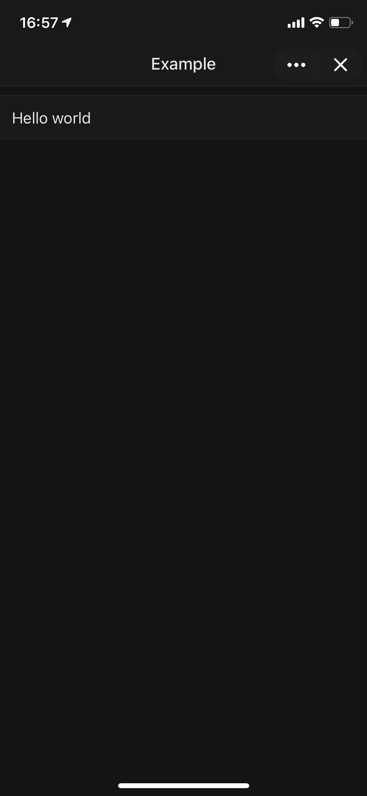
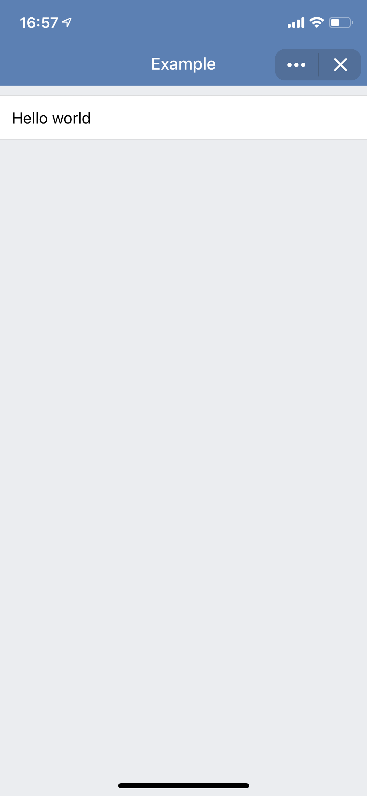

## What is this about?
This is a VK apps demo app that shows work with the color scheme on iOS.

```javascript
import 'core-js/es6/map';
import 'core-js/es6/set';
import React from 'react';
import ReactDOM from 'react-dom';
import connect from '@vkontakte/vkui-connect';
import App from './App';

connect.subscribe((e) => {
   switch (e.detail.type) {
       case 'VKWebAppUpdateConfig':
           let schemeAttribute = document.createAttribute('scheme');
           schemeAttribute.value = e.detail.data.scheme ? e.detail.data.scheme : 'client_light';
           document.body.attributes.setNamedItem(schemeAttribute);
           break;

       default:
           console.log(e.detail.type);
   }
});

// Init VK App
connect.send('VKWebAppInit', {});

ReactDOM.render(<App />, document.getElementById('root'));
```

## Live Demo

* In VK: https://vk.com/app6761392
* On GitHub Pages: https://VKCOM.github.io/vk-apps-themes-example

 

## How to start

`yarn start` || `npm start` — this will start dev server with hot reload on `localhost:10888`.

`yarn run build` || `npm run build` — this will build production bundle, with treeshaking, uglify and all this modern fancy stuff
